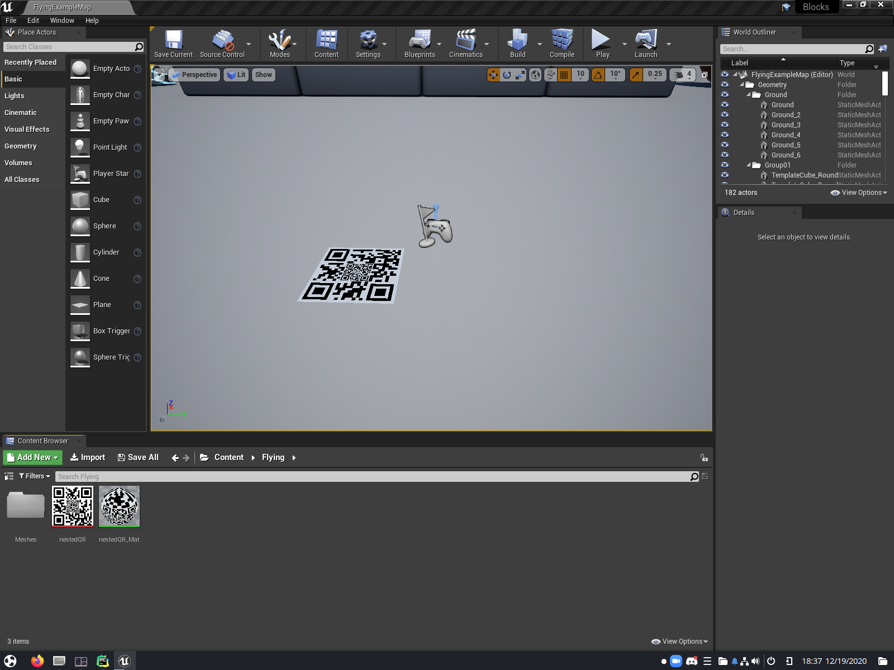

# Running the Development Environment

This document assumes that you have read and followed the instructions in
[Setting Up the Development Environment](dev_environment_setup.md). Please do so prior to reading the following
instructions.

# Generate a QR Code

If you have not done so, follow [this guide to generate a QR code](generate_qr_code.md).

# Starting Unreal Engine

Execute the following:

```bash
UnrealEngine/Engine/Binaries/Linux/UE4Editor 
```

This will start the Unreal Engine editor. Eventually, a window will open asking you which project you would like to work
on. Choose the Blocks environment at `AirSim/Unreal/Environments/Blocks`. If you get prompts to convert project, look
for More Options or Convert-In-Place option. If you get prompted to build, choose Yes. If you get prompted to disable
AirSim plugin, choose No.

This will load the Blocks environment into the editor. 
When you first load the map, it will take a significant amount of time to compile shaders. Thereafter, the game will
cache the shaders, which will speed up subsequent testing runs. We need to place a landing pad that the drone can find.
You can see that I have already placed one in the screenshot. First, we must add our QR code texture to the editor. This
can be done by clicking and dragging the image file into the Content Browser, or by clicking the green button labeled "
Add New" in the lower left. We must configure the texture so that it does not blur at longer distances. Right click the
texture in the Content Browser. Select "Edit...". A texture editor window will pop up. In the search bar on the right,
type "Mip Gen Settings". When the option comes up, select "NoMipmaps" from the dropdown. You may now save and close the
texture editor.

Notice the flag-and-gamepad icon in the play window. This is where the drone will start out. On the left bar, click and
drag the Plane object and place it near to the drone's start location. Drag the texture to the Plane to apply it.

You must scale the Plane to the appropriate size. The plane must be scaled such that the outermost code is 1 meter per
side. The Plane should default to a 1m x 1m square. Thus, you must use a scaling factor equal to:
(modules across + 2 * quiet zone width)/(modules across). For example, the above test code is 25 modules across and has
a quiet zone of 2x. Thus, the appropriate scaling factor is (25 + 2 * 2)/25 = 29/25.

Unreal Editor is now set up to run the project. You will probably want to save this project, so you do not have to
perform these steps every time you want to test the project.

There is a very specific order in which you must run the programs for testing.

First, start Unreal Engine. Press the large button labeled "Play" at the top of the screen. Unreal Editor should appear
to freeze. This is expected, due to the fact that AirSim runs in lockstep with ArduCopter.

Then, run Arducopter:

```bash
python3 Tools/autotest/sim_vehicle.py -v ArduCopter -f airsim-copter --console
```

Finally, run the software:

```bash
cd precision_drone_landing
python __main__.py
```

When you wish to stop testing, stop Unreal Engine first, otherwise it will appear to freeze. Luckily, Unreal Engine does
not need to be restarted every time, and you may press "Play" and "Stop" instead. Our software as well as Ardupilot must
be restarted after every test run.
