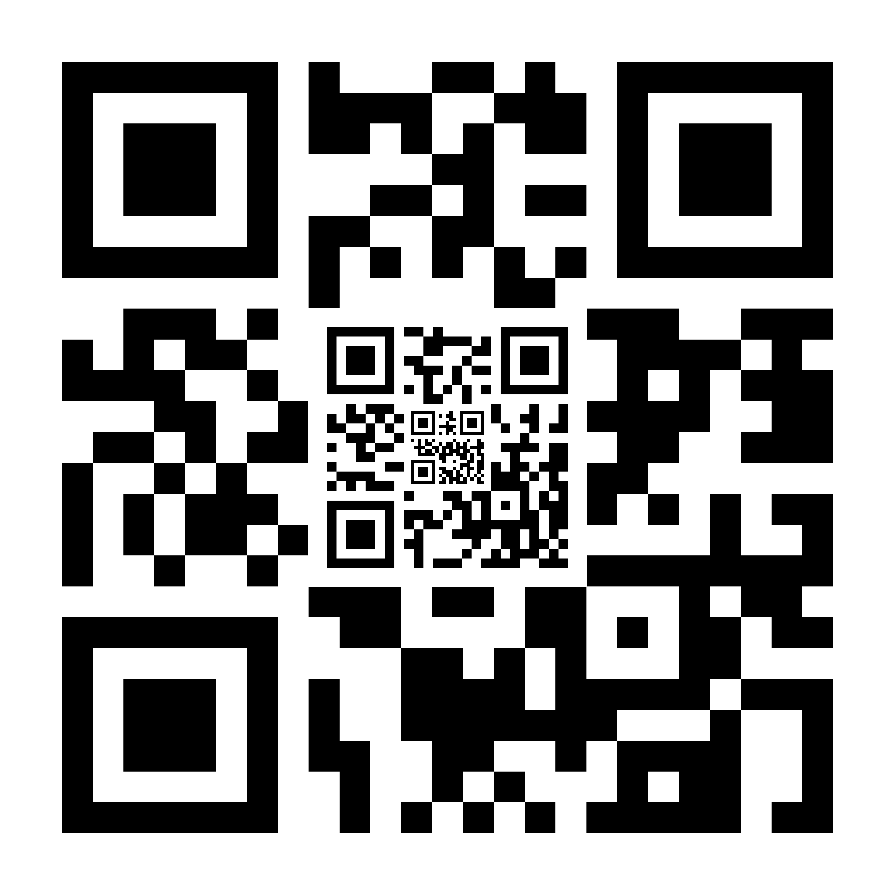

# Generating a QR code

Our software includes a QR generator script. Run this command to generate a QR code image.

```bash
python project_root/scripts/qr_generator.py 'lvl0data' 'lvl1data' 'lvl2data' -p 'outputlocation.png'
```

Please remember to fill in the command where indicated. Each level of the QR code can fit a maximum of 6 bytes of data.
As of writing, our data parser expects the code to be of the form, in regular expression: `^.{,4},[012]$`. Moreover, it
is required that the level 0 code end in the ASCII character 0, the level 1 code end in the ASCII character 1, and so
on. Here are a few examples of valid data: `asdf,1`, `beep,0`, `foo,2`.

Each code as generated is actually a composite of three QR codes, nested inside each other. This is a non-compliant
usage of the QR specification, but it was required to ensure accurate landings. The intention is for the former part of
the data to be used to identify the landing zone. However, we have not developed the specifics of this plan. It is
possible for each level to contain a different identifying portion, but we have not decided if we should use that
capability. For testing purposes, a meaningless code could be used, for example:

```bash
python scripts/qr_generator.py 'test,0' 'test,1' 'test,2' -p 'test_qr_code.png'
```

Here is the image generated by that command, which you may use if you wish:



## About the generated QR code

Each of the three layered codes is a version 2 code (25x25 modules) with a 2x quiet zone. The file
[qr_sizes.json](../config/qr_sizes.json) lists the expected size of the codes in meters. Note that the outer code is
intended to be 1 meter *not including the quiet zone.* This means that the image must be printed *larger* than 1m to
account for the quiet zone.
