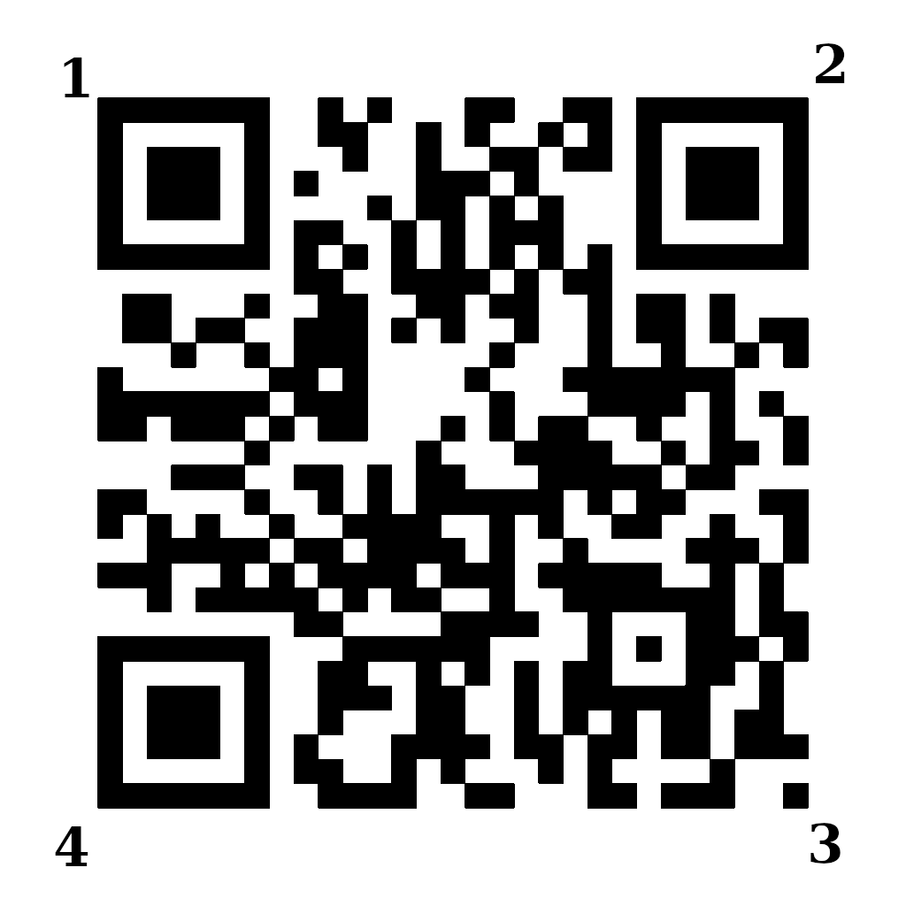
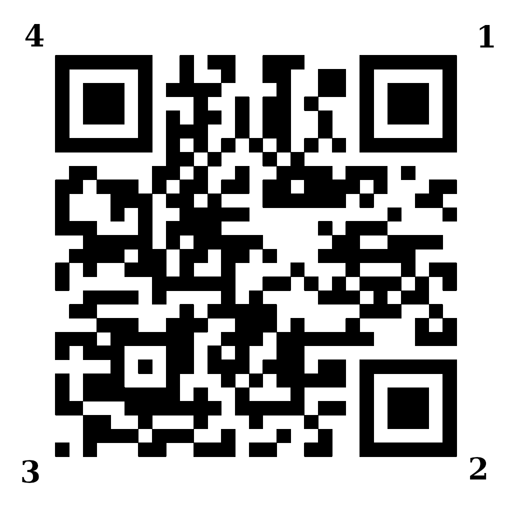
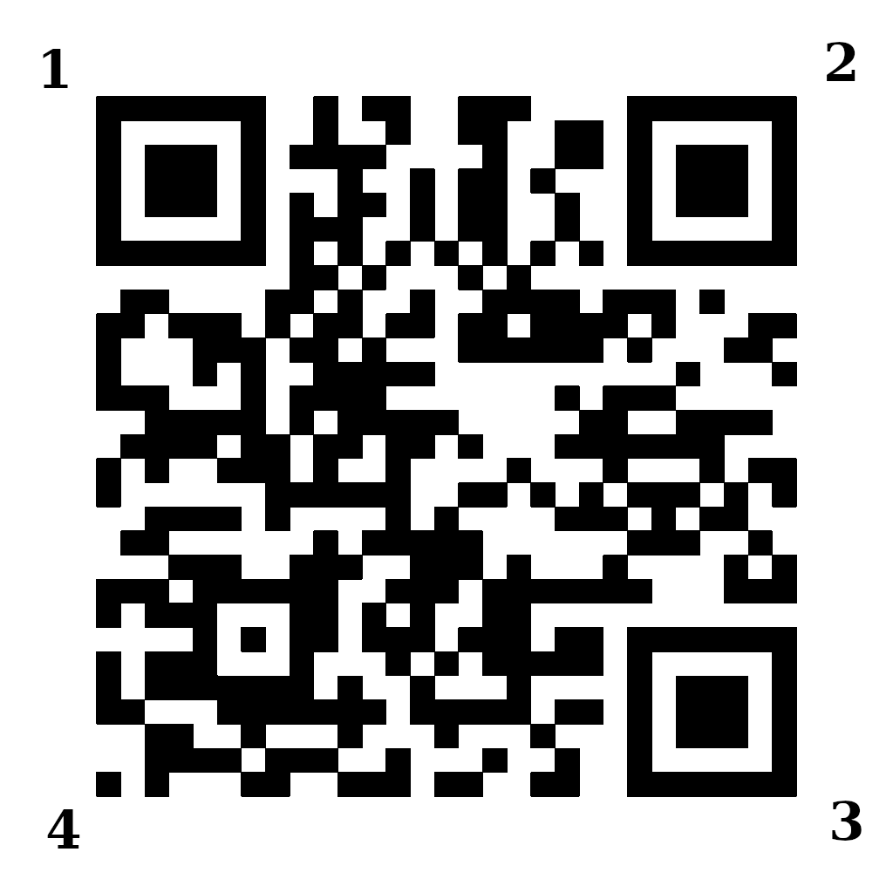

# Technical Debt

In developing this project we have been forced to make tradeoffs between speed of development now and speed of
development later. The build-up of these tradeoffs is colloquially known as "technical debt." This document is to
enumerate known points of technical debt, as well as possible avenues of improvement which would eliminate them, as well
as possible areas of improvement for future developers.

## Patched PyZBar in source directory

This project requires that our QR code reader does a number of things. First, the QR codes must have a "hull." That is,
when a QR code is read, the reader must also return the pixel location of the QR code's corners. We require that the
ordering of the corners is consistent with respect to rotation of the QR code. That is, the ordering of the corners
should not change when the code is rotated. However, the actual ordering does not matter as long as it is consistent.
Example follows:

### Example of QR code ordering

#### Initial QR ordering

This is the initial ordering in our example. The particular ordering is irrelevant.

#### Correct ordering after rotation

This is the correct ordering when the QR code is rotated. Notice that the corner without an eye is still at position 3,
and so on for the other corners.

#### Incorrect ordering

This is the wrong ordering of the points. Notice that the corner without an eye is now labeled 4, whereas in the initial
ordering it was labeled 3.

### Explanation

This is our motivation for patching PyZBar. It provides the positions for the corners, but does not keep their ordering
consistent. However, the underlying ZBar library does provide that information. Thus, it is an easy thing to fix.
See [PyZBar PR #78](https://github.com/NaturalHistoryMuseum/pyzbar/pull/78). Unfortunately, the PyZBar maintainers have
not released an update in nearly (as of writing) two years. We found it unlikely that this change would be introduced in
mainline PyZBar, and we have thus forked the project and applied the PR #78 patch.

The problem with our solution is that the patched PyZBar currently resides in our source directory,
at `<project root>/precision_drone_landing/pyzbar79/`.

### Proposed Solution

The correct way to handle this situation would be to package the patched version of PyZBar as a PyPi package so that it
could be separate from the project, but still can be installed automatically with `pip`.
See [the PyPi packaging documentation](https://packaging.python.org/tutorials/packaging-projects/).

## QR detection library selection

The project currently uses the PyZBar library to detect QR codes. However, this choice was made more because it was the
first option we came across rather than that we determined that it was the best. There are a number of libraries for
detecting QR codes out there. We have not tested other libraries, their effectiveness, or their speed. However, the
BoofCV project has
[performed some experimentation on this topic](https://boofcv.org/index.php?title=Performance:QrCode).

We have identified that of the metrics evaluated in the experiment above, the most important for our project are:

* Perspective
* Rotations
* Non-compliant
* Shadows
* Bright Spots
* Brightness
* Glare

Further, we find the following metrics of lesser importance:

* Blurred
* Close
* Curved
* Damaged
* High Version
* Lots
* Monitor
* Pathological

Speed of detection is also a highly important metric, as QR detection is one of the longest-running computations in our
runtime loop.

### Proposed Solution

Using the BoofCV data as a guideline, test the effectiveness of various QR recognization libraries. Use whichever
library provides the best performance for this application.

## Displacement detection model checked into Git

Our current solution requires a machine learning model to estimate the distance from the drone to the target. Training
this model takes a significant amount of time (think hours). Moreover, since we are able to generate as much training
data for the model as we need, there is no need to re-run the model when we acquire new data. The only practical reason
to retrain the model is to try different hyperparameters. Thus, the model is checked into Git as a
`.pkl` at `<project root>/assets/displacement_detection_models/regressor.pkl`. This is undesireable, since the regressor
is a large binary object, and we also check in the code which generates the regessor.

### Proposed Solution

Determine some storage method of the regressor which:

* Does not require that the regressor is checked into Git.
* Does not require that the regressor is trained at deploy-time.
* Automatically generates a new regressor when the generation code is changed.
* Does not require special treatment for the `aarch` and `master` branches
